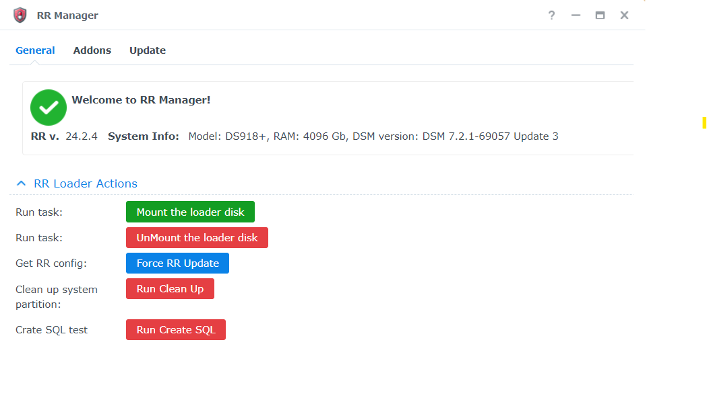

# What is that?

RRManager is a Redpill Recovery DSM application aimed to provide the ability to configure/update RR without booting to RR recovery. This package is for experienced users. 

❗❗❗ Required `RR v.24.2.4`

### Features
 - [x] upload and install update from the DSM
 - [x] run custom jobs with ui(`clean_system_disk.cgi`, etc..)
 - [ ] manage addons (in progress)

That app is built on the `DSM` UI framework: `Ext.Js 3.4`.
I didn't find documentaion regarding that framework, so I spent a lot of time to reserch how to build ui and call DSM actions utilyzing that approach. That is why the ui is so unperfect))

# Instalation
1. Download RR Manager spk file from github
2. Install SPK
3. Setup tasks
4. Run `SetRootPrivsToRrManager` taks to add root privilages to the `RR Manager`.


# How to setup tasks
Create folowing tasks manually that must be runned behalf of `root`:

- RunRrUpdate:
```bash
/usr/bin/rr-update.sh updateRR /volume1/downloads/tmp_rr_update/update.zip /tmp/rr_update_progress
```

- SetRootPrivsToRrManager:
```bash
sed -i 's/package/root/g' /var/packages/rr-manager/conf/privilege
synopkg restart rr-manager
```

## How does it works?
That app using `/downloads` folder to upload the update.zip. Then the script of the that was made by RR maintainer will be runned. `RR Manager` is implementing only UI for the update process.

## TODO:
- [ ] fix ui
- [ ] remove manual steps to create task
